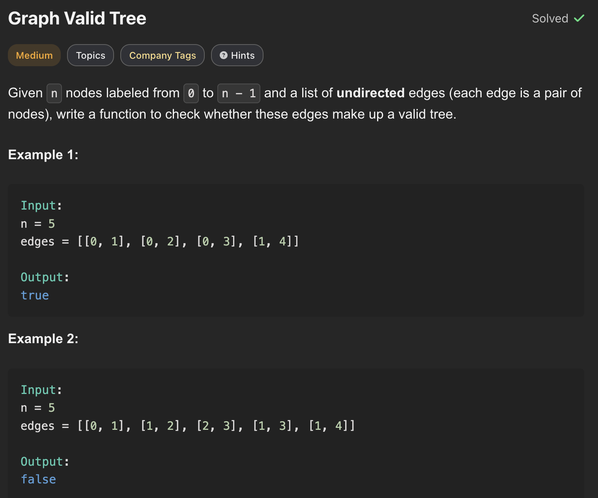
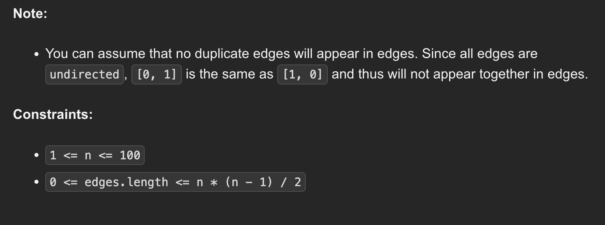

---

### 1. Depth First Search (DFS)

**Intuition:**
We can use DFS to traverse the graph starting from node `0`. To detect cycles in an undirected graph, we must pass the `parent` node into our DFS calls. If we ever visit a node that is already in our `visited` set (and that node is *not* the parent we just came from), we have found a cycle. After the traversal, if the size of the `visited` set equals `n`, the graph is fully connected.

```javascript
class Solution {
    /**
     * @param {number} n
     * @param {number[][]} edges
     * @returns {boolean}
     */
    validTree(n, edges) {
        // A valid tree must have exactly n - 1 edges
        if (edges.length > n - 1) {
            return false;
        }

        // Build adjacency list
        const adj = Array.from({ length: n }, () => []);
        for (const [u, v] of edges) {
            adj[u].push(v);
            adj[v].push(u);
        }

        const visit = new Set();
        
        const dfs = (node, parent) => {
            if (visit.has(node)) {
                return false; // Cycle detected
            }

            visit.add(node);
            for (const nei of adj[node]) {
                if (nei === parent) {
                    continue; // Don't falsely detect a cycle by going back to parent
                }
                if (!dfs(nei, node)) {
                    return false;
                }
            }
            return true;
        };

        // Graph must be cycle-free AND fully connected
        return dfs(0, -1) && visit.size === n;
    }
}

```

#### **Time & Space Complexity**

* **Time Complexity:** $O(V + E)$ where $V$ is the number of vertices and $E$ is the number of edges.
* **Space Complexity:** $O(V + E)$ to store the adjacency list and recursion stack.

---

### 2. Breadth First Search (BFS)

**Intuition:**
This is the iterative equivalent of the DFS approach. We use a queue to explore the graph level by level. To avoid falsely detecting a cycle when looking at the node we just came from, we store the `[currentNode, parentNode]` pair in the queue.

```javascript
class Solution {
    /**
     * @param {number} n
     * @param {number[][]} edges
     * @returns {boolean}
     */
    validTree(n, edges) {
        if (edges.length > n - 1) {
            return false;
        }

        const adj = Array.from({ length: n }, () => []);
        for (const [u, v] of edges) {
            adj[u].push(v);
            adj[v].push(u);
        }

        const visit = new Set();
        // Queue stores [currentNode, parentNode]
        // Assuming Queue class exists, or use array with push/shift
        const q = new Queue([[0, -1]]); 
        visit.add(0);

        while (!q.isEmpty()) {
            const [node, parent] = q.pop();
            for (const nei of adj[node]) {
                if (nei === parent) continue; // Skip parent
                
                if (visit.has(nei)) return false; // Cycle detected
                
                visit.add(nei);
                q.push([nei, node]);
            }
        }

        return visit.size === n;
    }
}

```

#### **Time & Space Complexity**

* **Time Complexity:** $O(V + E)$
* **Space Complexity:** $O(V + E)$

---

### 3. Disjoint Set Union (DSU)

**Intuition:**
Union-Find is arguably the most elegant way to solve this specific problem.
Initially, every node is its own separate component. We iterate through the given edges and attempt to `union` the two connected nodes.

* If two nodes are *already* in the same component when we try to connect them, adding this edge creates a cycle!
* If we process all edges without finding a cycle, a valid tree will be left with exactly `1` connected component at the end.

```javascript
class DSU {
    constructor(n) {
        this.comps = n;
        this.Parent = Array.from({ length: n + 1 }, (_, i) => i);
        this.Size = Array(n + 1).fill(1);
    }

    find(node) {
        // Path compression
        if (this.Parent[node] !== node) {
            this.Parent[node] = this.find(this.Parent[node]);
        }
        return this.Parent[node];
    }

    union(u, v) {
        let pu = this.find(u);
        let pv = this.find(v);
        
        // If they share the same parent, connecting them forms a cycle
        if (pu === pv) return false; 
        
        // Union by size
        if (this.Size[pu] < this.Size[pv]) {
            [pu, pv] = [pv, pu]; // Swap to ensure pu is the larger set
        }
        
        this.comps--;
        this.Size[pu] += this.Size[pv];
        this.Parent[pv] = pu;
        return true;
    }

    components() {
        return this.comps;
    }
}

class Solution {
    /**
     * @param {number} n
     * @param {number[][]} edges
     * @returns {boolean}
     */
    validTree(n, edges) {
        // A valid tree must have exactly n - 1 edges
        if (edges.length > n - 1) {
            return false;
        }

        const dsu = new DSU(n);
        
        for (const [u, v] of edges) {
            if (!dsu.union(u, v)) {
                return false; // Cycle detected during union
            }
        }
        
        // Must be fully connected (exactly 1 component remaining)
        return dsu.components() === 1;
    }
}

```

#### **Time & Space Complexity**

* **Time Complexity:** $O(V + E \cdot \alpha(V))$ where $\alpha$ is the inverse Ackermann function, which operates in nearly constant time.
* **Space Complexity:** $O(V)$ to store the `Parent` and `Size` arrays.
