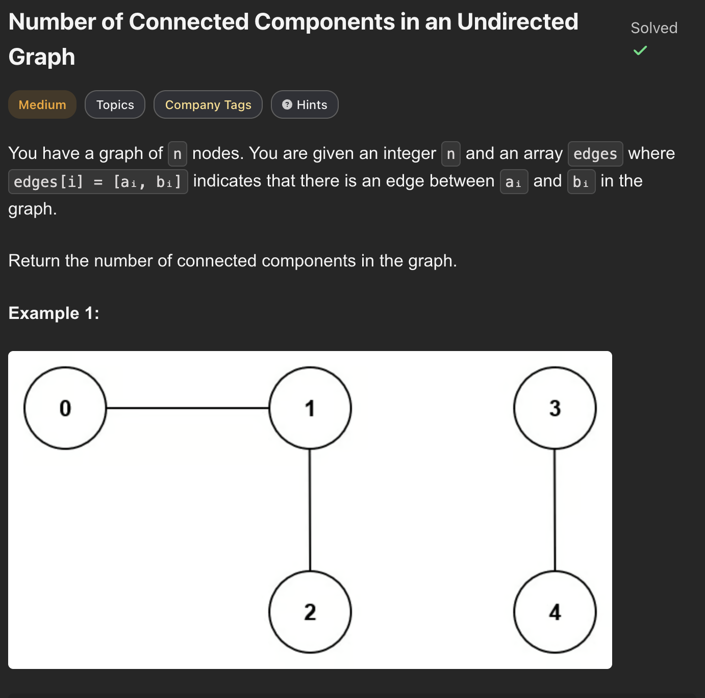
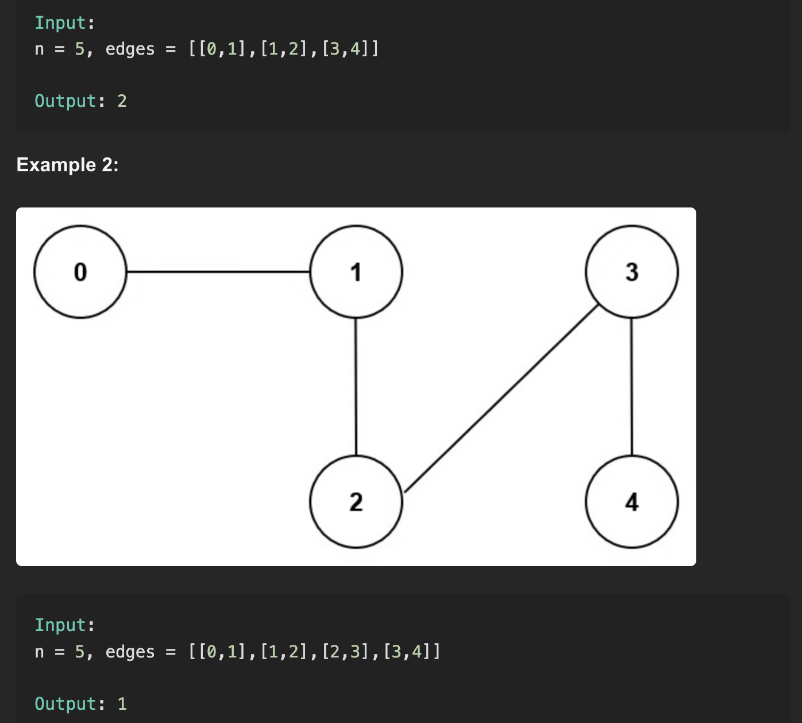
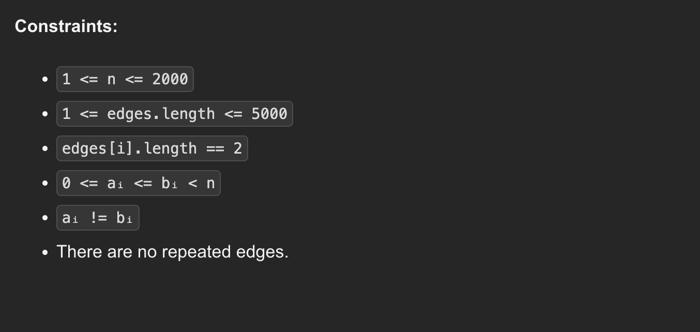

---

### 1. Depth First Search (DFS)

**Intuition:**
A connected component is a group of nodes where every node is reachable from any other node in that group. If we start a DFS from an unvisited node, it will exhaustively visit **all nodes** within that specific connected component. By counting how many times we are forced to start a *new* DFS from an unvisited node, we effectively count the number of isolated components.

```javascript
class Solution {
    /**
     * @param {number} n
     * @param {number[][]} edges
     * @returns {number}
     */
    countComponents(n, edges) {
        // Build an adjacency list
        const adj = Array.from({ length: n }, () => []);
        const visit = Array(n).fill(false);

        for (const [u, v] of edges) {
            adj[u].push(v);
            adj[v].push(u);
        }

        const dfs = (node) => {
            for (const nei of adj[node]) {
                if (!visit[nei]) {
                    visit[nei] = true;
                    dfs(nei);
                }
            }
        };

        let res = 0;
        // Iterate through all nodes
        for (let node = 0; node < n; node++) {
            if (!visit[node]) {
                visit[node] = true;
                dfs(node);
                res++; // We found a new, distinct component
            }
        }
        return res;
    }
}

```

#### **Time & Space Complexity**

* **Time Complexity**: $O(V + E)$ where $V$ is the number of vertices and $E$ is the number of edges.
* **Space Complexity**: $O(V + E)$ to store the adjacency list and the recursion stack.

---

### 2. Breadth First Search (BFS)

**Intuition:**
This follows the exact same logic as DFS, but uses a Queue to explore each connected component level by level. Every time the queue empties, one full component has been mapped. If unvisited nodes remain in our main loop, we start a new BFS and increment our component counter.

```javascript
class Solution {
    /**
     * @param {number} n
     * @param {number[][]} edges
     * @returns {number}
     */
    countComponents(n, edges) {
        const adj = Array.from({ length: n }, () => []);
        const visit = Array(n).fill(false);

        for (const [u, v] of edges) {
            adj[u].push(v);
            adj[v].push(u);
        }

        const bfs = (node) => {
            // Assumes Queue class exists, otherwise use an array
            const q = new Queue([node]); 
            visit[node] = true;
            
            while (!q.isEmpty()) {
                const cur = q.pop();
                for (const nei of adj[cur]) {
                    if (!visit[nei]) {
                        visit[nei] = true;
                        q.push(nei);
                    }
                }
            }
        };

        let res = 0;
        for (let node = 0; node < n; node++) {
            if (!visit[node]) {
                bfs(node);
                res++;
            }
        }
        return res;
    }
}

```

#### **Time & Space Complexity**

* **Time Complexity**: $O(V + E)$.
* **Space Complexity**: $O(V + E)$ for the adjacency list and queue.

---

### 3. Disjoint Set Union (DSU)

**Intuition:**
This is a highly efficient approach for grouping connected items.

1. We start by assuming every single node is its own isolated component (total components = `n`).
2. We process the edges one by one. If an edge connects two nodes that are in *different* sets, we merge them (union) and decrease our total component count by 1.
3. If the edge connects nodes already in the same set, it's just a cycle within a component, so the count stays the same.

```javascript
class DSU {
    /**
     * @param {number} n
     */
    constructor(n) {
        this.parent = Array.from({ length: n }, (_, i) => i);
        this.rank = Array(n).fill(1);
    }

    /**
     * @param {number} node
     * @return {number}
     */
    find(node) {
        let cur = node;
        while (cur !== this.parent[cur]) {
            // Path compression for efficiency
            this.parent[cur] = this.parent[this.parent[cur]];
            cur = this.parent[cur];
        }
        return cur;
    }

    /**
     * @param {number} u
     * @param {number} v
     * @return {boolean}
     */
    union(u, v) {
        let pu = this.find(u);
        let pv = this.find(v);
        
        // Already in the same component
        if (pu === pv) {
            return false;
        }
        
        // Union by rank
        if (this.rank[pv] > this.rank[pu]) {
            [pu, pv] = [pv, pu];
        }
        this.parent[pv] = pu;
        this.rank[pu] += this.rank[pv];
        return true;
    }
}

class Solution {
    /**
     * @param {number} n
     * @param {number[][]} edges
     * @returns {number}
     */
    countComponents(n, edges) {
        const dsu = new DSU(n);
        let res = n; // Start with n components
        
        for (const [u, v] of edges) {
            // If the union is successful, two components merged into one
            if (dsu.union(u, v)) {
                res--; 
            }
        }
        return res;
    }
}

```

#### **Time & Space Complexity**

* **Time Complexity**: $O(V + E \cdot \alpha(V))$ where $\alpha$ is the inverse Ackermann function (effectively constant time).
* **Space Complexity**: $O(V)$ to store the `parent` and `rank` arrays.

