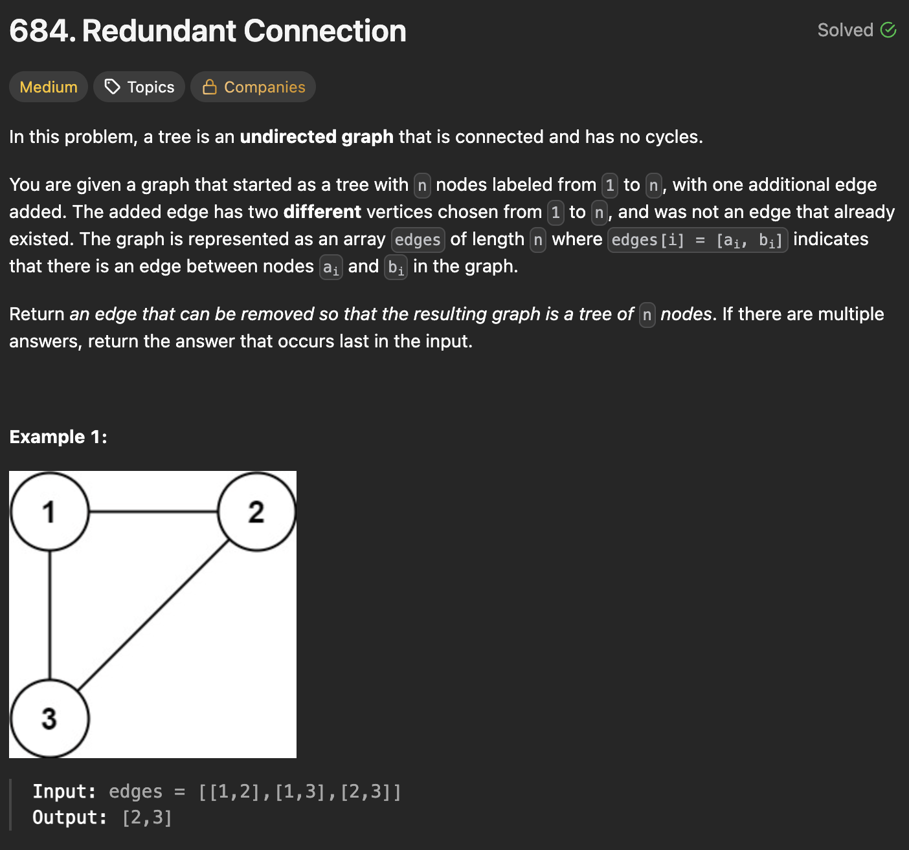
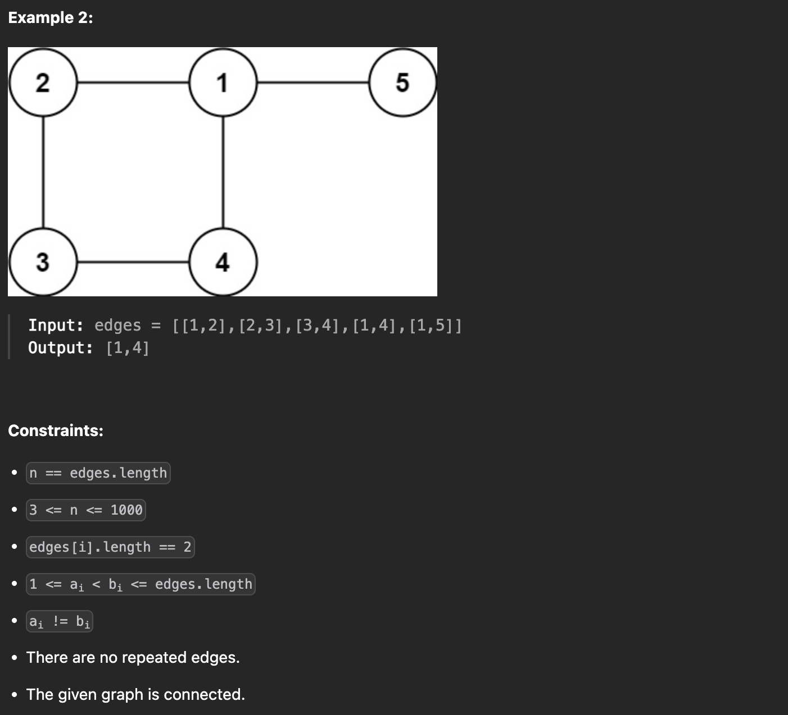

---

### 1. Cycle Detection (DFS - Brute Force)

**Intuition:**
We can build the graph edge by edge. Before adding a new edge $(u, v)$, we run a Depth First Search (DFS) to see if a path already exists between $u$ and $v$. If a path exists, adding the edge $(u, v)$ will create a cycle. Since we process edges in the order they appear in the input, the first edge that creates a cycle is our answer. 🐢

```javascript
class Solution {
    /**
     * @param {number[][]} edges
     * @return {number[]}
     */
    findRedundantConnection(edges) {
        const n = edges.length;
        const adj = Array.from({ length: n + 1 }, () => []);

        const dfs = (node, target, visited) => {
            if (node === target) return true;
            
            visited[node] = true;
            for (const nei of adj[node]) {
                if (!visited[nei]) {
                    if (dfs(nei, target, visited)) return true;
                }
            }
            return false;
        };

        for (const [u, v] of edges) {
            const visited = Array(n + 1).fill(false);
            
            // Check if u and v are already connected
            if (dfs(u, v, visited)) {
                return [u, v]; // This edge creates a cycle
            }
            
            // Otherwise, add the edge to the graph
            adj[u].push(v);
            adj[v].push(u);
        }
        return [];
    }
}

```

#### **Time & Space Complexity**

* **Time Complexity**: $O(E \cdot (V + E))$. For every edge, we potentially run a full DFS.
* **Space Complexity**: $O(V + E)$ for the adjacency list and recursion stack.

---

### 2. Depth First Search (Optimal Cycle Finding)

**Intuition:**
Instead of running DFS for every edge, we build the entire graph with all edges first. We know there is exactly one cycle. We run a single DFS to trace that cycle and record all the nodes involved. Once we have the set of nodes in the cycle, we scan the input `edges` from right to left (end to start) and return the first edge where *both* endpoints are part of the cycle.

```javascript
class Solution {
    /**
     * @param {number[][]} edges
     * @return {number[]}
     */
    findRedundantConnection(edges) {
        const n = edges.length;
        const adj = Array.from({ length: n + 1 }, () => []);

        for (const [u, v] of edges) {
            adj[u].push(v);
            adj[v].push(u);
        }

        const visit = Array(n + 1).fill(false);
        const cycle = new Set();
        let cycleStart = -1;

        const dfs = (node, par) => {
            if (visit[node]) {
                cycleStart = node; // Found the start of the cycle
                return true;
            }
            
            visit[node] = true;
            for (const nei of adj[node]) {
                if (nei === par) continue; // Don't look back at parent
                
                if (dfs(nei, node)) {
                    // We are unwinding the recursion through the cycle
                    if (cycleStart !== -1) {
                        cycle.add(node);
                    }
                    // Stop adding to cycle once we wrap around to the start
                    if (node === cycleStart) {
                        cycleStart = -1; 
                    }
                    return true;
                }
            }
            return false;
        };

        dfs(1, -1);

        // Scan edges in reverse to find the last one belonging to the cycle
        for (let i = edges.length - 1; i >= 0; i--) {
            const [u, v] = edges[i];
            if (cycle.has(u) && cycle.has(v)) {
                return [u, v];
            }
        }
        return [];
    }
}

```

#### **Time & Space Complexity**

* **Time Complexity**: $O(V + E)$
* **Space Complexity**: $O(V + E)$

---

### 3. Topological Sort (Kahn's Algorithm / Trimming)

**Intuition:**
A node that has only 1 connected edge (degree = 1) is a "leaf" and cannot possibly be part of a cycle.

1. We compute the degree of every node.
2. We repeatedly remove leaf nodes (degree 1) and decrement the degree of their neighbors.
3. Any node that eventually becomes degree 1 is also removed.
4. When we can't remove any more nodes, the nodes left with degree > 1 are exactly the nodes forming the cycle.
5. We scan the input edges backward to find the answer.

```javascript
class Solution {
    /**
     * @param {number[][]} edges
     * @return {number[]}
     */
    findRedundantConnection(edges) {
        const n = edges.length;
        const degree = new Array(n + 1).fill(0);
        const adj = Array.from({ length: n + 1 }, () => []);
        
        for (const [u, v] of edges) {
            adj[u].push(v);
            adj[v].push(u);
            degree[u]++;
            degree[v]++;
        }

        const q = []; // Using array as queue
        for (let i = 1; i <= n; i++) {
            if (degree[i] === 1) q.push(i);
        }

        // Trim branches
        while (q.length > 0) {
            const node = q.shift();
            degree[node]--; // logically remove
            
            for (const nei of adj[node]) {
                degree[nei]--;
                if (degree[nei] === 1) {
                    q.push(nei);
                }
            }
        }

        // Cycle nodes will have degree > 1
        for (let i = edges.length - 1; i >= 0; i--) {
            const [u, v] = edges[i];
            if (degree[u] > 1 && degree[v] > 1) {
                return [u, v];
            }
        }
        return [];
    }
}

```

#### **Time & Space Complexity**

* **Time Complexity**: $O(V + E)$
* **Space Complexity**: $O(V + E)$

---

### 4. Disjoint Set Union (DSU - Optimal & Standard)

**Intuition:**
This is the most elegant and standard way to solve this problem.

1. Initially, every node is in its own disjoint set.
2. We iterate through the given edges in order.
3. For each edge $(u, v)$, we try to `union` their sets.
4. If $u$ and $v$ are **already in the same set** (meaning they share the same parent root), adding this edge creates a cycle! Since we iterate in the given order, the first edge that causes this is our answer. ✅

```javascript
class DSU {
    constructor(n) {
        this.parent = Array.from({ length: n + 1 }, (_, i) => i);
        this.rank = new Array(n + 1).fill(1);
    }

    find(node) {
        if (this.parent[node] !== node) {
            this.parent[node] = this.find(this.parent[node]); // Path compression
        }
        return this.parent[node];
    }

    union(u, v) {
        let rootU = this.find(u);
        let rootV = this.find(v);

        // If they have the same root, connecting them forms a cycle
        if (rootU === rootV) {
            return false;
        }

        // Union by rank
        if (this.rank[rootU] > this.rank[rootV]) {
            this.parent[rootV] = rootU;
            this.rank[rootU] += this.rank[rootV];
        } else {
            this.parent[rootU] = rootV;
            this.rank[rootV] += this.rank[rootU];
        }
        return true;
    }
}

class Solution {
    /**
     * @param {number[][]} edges
     * @return {number[]}
     */
    findRedundantConnection(edges) {
        const dsu = new DSU(edges.length);

        for (const [u, v] of edges) {
            if (!dsu.union(u, v)) {
                return [u, v];
            }
        }
        return [];
    }
}

```

#### **Time & Space Complexity**

* **Time Complexity**: $O(E \cdot \alpha(V))$, where $\alpha$ is the nearly-constant inverse Ackermann function. Effectively $O(V)$.
* **Space Complexity**: $O(V)$ for the parent and rank arrays.