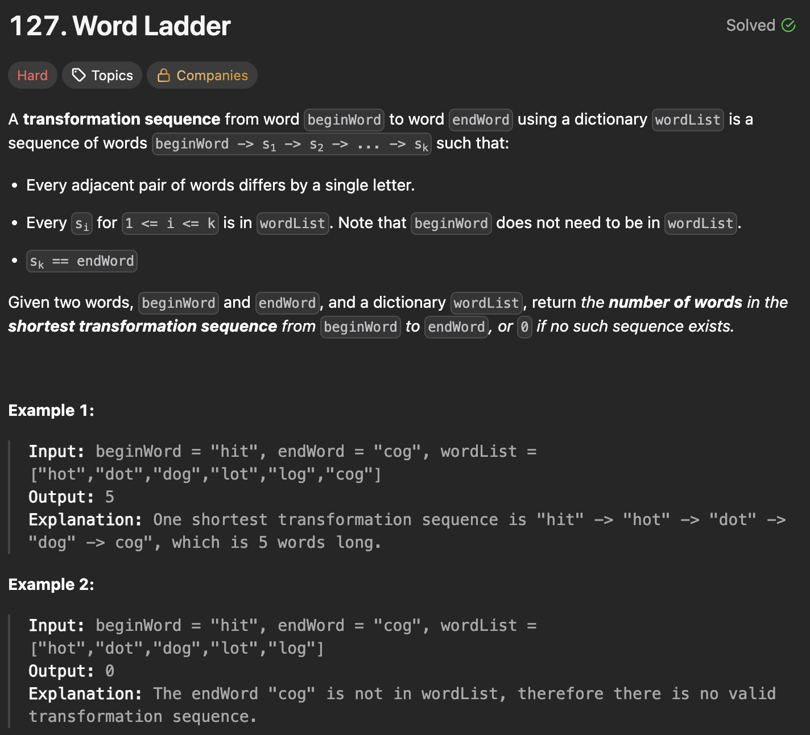
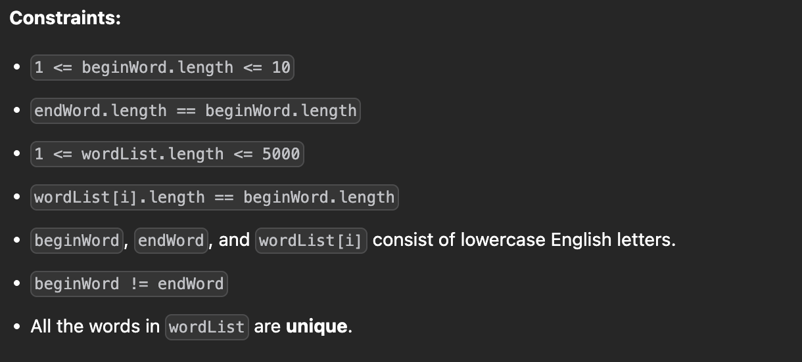

---

### 1. Breadth First Search - I (Pairwise Adjacency Graph)

**Intuition:**
We can treat this as finding the shortest path in an unweighted graph. In this approach, we precompute the adjacency list by comparing every single pair of words in the `wordList`. If two words differ by exactly one character, we connect them.
*Note: Comparing all pairs makes this approach very slow for large word lists.*

```javascript
class Solution {
    /**
     * @param {string} beginWord
     * @param {string} endWord
     * @param {string[]} wordList
     * @return {number}
     */
    ladderLength(beginWord, endWord, wordList) {
        if (!wordList.includes(endWord) || beginWord === endWord) {
            return 0;
        }

        const n = wordList.length;
        const m = wordList[0].length;
        const adj = Array.from({ length: n }, () => []);
        const mp = new Map();
        
        for (let i = 0; i < n; i++) {
            mp.set(wordList[i], i);
        }

        // Build adjacency list by comparing all pairs
        for (let i = 0; i < n; i++) {
            for (let j = i + 1; j < n; j++) {
                let cnt = 0;
                for (let k = 0; k < m; k++) {
                    if (wordList[i][k] !== wordList[j][k]) cnt++;
                }
                if (cnt === 1) {
                    adj[i].push(j);
                    adj[j].push(i);
                }
            }
        }

        const q = [];
        let res = 1;
        const visit = new Set();

        // Find initial neighbors for beginWord
        for (let i = 0; i < m; i++) {
            for (let c = 97; c <= 122; c++) { // 'a' to 'z'
                const char = String.fromCharCode(c);
                if (char === beginWord[i]) continue;
                
                const word = beginWord.slice(0, i) + char + beginWord.slice(i + 1);
                if (mp.has(word) && !visit.has(mp.get(word))) {
                    q.push(mp.get(word));
                    visit.add(mp.get(word));
                }
            }
        }

        // Standard BFS
        while (q.length > 0) {
            res++;
            const len = q.length;
            for (let i = 0; i < len; i++) {
                const node = q.shift();
                if (wordList[node] === endWord) return res;
                
                for (const nei of adj[node]) {
                    if (!visit.has(nei)) {
                        visit.add(nei);
                        q.push(nei);
                    }
                }
            }
        }

        return 0;
    }
}

```

#### **Time & Space Complexity**

* **Time Complexity**: $O(n^2 \cdot m)$
* **Space Complexity**: $O(n^2)$

---

### 2. Breadth First Search - II (Generate Neighbors on the Fly)

**Intuition:**
Instead of building a massive graph upfront, we generate neighbors on the fly. For the current word, we replace each character with every letter from 'a' to 'z' and check if this new word exists in our `wordList` (which we convert to a `Set` for instant lookups).

```javascript
class Solution {
    /**
     * @param {string} beginWord
     * @param {string} endWord
     * @param {string[]} wordList
     * @return {number}
     */
    ladderLength(beginWord, endWord, wordList) {
        const words = new Set(wordList);
        if (!words.has(endWord) || beginWord === endWord) {
            return 0;
        }

        let res = 0;
        const q = [beginWord];

        while (q.length > 0) {
            res++;
            const len = q.length;
            
            for (let k = 0; k < len; k++) {
                const node = q.shift();
                if (node === endWord) return res;
                
                // Generate all possible 1-character mutations
                for (let i = 0; i < node.length; i++) {
                    for (let c = 97; c <= 122; c++) {
                        const char = String.fromCharCode(c);
                        if (char === node[i]) continue;
                        
                        const nei = node.slice(0, i) + char + node.slice(i + 1);
                        if (words.has(nei)) {
                            q.push(nei);
                            words.delete(nei); // Mark as visited by removing
                        }
                    }
                }
            }
        }
        return 0;
    }
}

```

#### **Time & Space Complexity**

* **Time Complexity**: $O(m^2 \cdot n)$
* **Space Complexity**: $O(m^2 \cdot n)$

---

### 3. Breadth First Search - III (Wildcard Pattern Precomputation)

**Intuition:**
This is the standard optimal approach for single-source BFS on this problem. We use wildcard patterns (like `*ot`, `h*t`, `ho*`) to group words together. If `hot` and `dot` both generate the pattern `*ot`, they are neighbors. This makes neighbor lookups $O(1)$ during the BFS.

```javascript
class Solution {
    /**
     * @param {string} beginWord
     * @param {string} endWord
     * @param {string[]} wordList
     * @return {number}
     */
    ladderLength(beginWord, endWord, wordList) {
        if (!wordList.includes(endWord)) return 0;

        const nei = new Map();
        wordList.push(beginWord);
        
        // Build the wildcard pattern map
        for (const word of wordList) {
            for (let j = 0; j < word.length; j++) {
                const pattern = word.slice(0, j) + '*' + word.slice(j + 1);
                if (!nei.has(pattern)) nei.set(pattern, []);
                nei.get(pattern).push(word);
            }
        }

        const visit = new Set([beginWord]);
        const q = [beginWord];
        let res = 1;

        while (q.length > 0) {
            const len = q.length;
            for (let i = 0; i < len; i++) {
                const word = q.shift();
                if (word === endWord) return res;
                
                // Look up neighbors using generated patterns
                for (let j = 0; j < word.length; j++) {
                    const pattern = word.slice(0, j) + '*' + word.slice(j + 1);
                    for (const neiWord of (nei.get(pattern) || [])) {
                        if (!visit.has(neiWord)) {
                            visit.add(neiWord);
                            q.push(neiWord);
                        }
                    }
                }
            }
            res++;
        }
        return 0;
    }
}

```

#### **Time & Space Complexity**

* **Time Complexity**: $O(m^2 \cdot n)$
* **Space Complexity**: $O(m^2 \cdot n)$

---

### 4. Meet In The Middle (Bidirectional BFS)

**Intuition:**
A standard BFS searches outward in a growing circle, which can become exponentially large. By starting a BFS from the `beginWord` and another from the `endWord` simultaneously, we can "meet in the middle". We continually expand whichever queue is currently smaller, heavily minimizing the search space.

```javascript
class Solution {
    /**
     * @param {string} beginWord
     * @param {string} endWord
     * @param {string[]} wordList
     * @return {number}
     */
    ladderLength(beginWord, endWord, wordList) {
        const wordSet = new Set(wordList);
        if (!wordSet.has(endWord) || beginWord === endWord) return 0;
        
        const m = beginWord.length;
        
        let qb = [beginWord];
        let qe = [endWord];
        
        let fromBegin = new Map([[beginWord, 1]]);
        let fromEnd = new Map([[endWord, 1]]);

        while (qb.length > 0 && qe.length > 0) {
            // Always expand the smaller frontier to save time
            if (qb.length > qe.length) {
                [qb, qe] = [qe, qb];
                [fromBegin, fromEnd] = [fromEnd, fromBegin];
            }
            
            const len = qb.length;
            for (let k = 0; k < len; k++) {
                const word = qb.shift();
                const steps = fromBegin.get(word);
                
                for (let i = 0; i < m; i++) {
                    for (let c = 97; c <= 122; c++) {
                        const char = String.fromCharCode(c);
                        if (char === word[i]) continue;
                        
                        const nei = word.slice(0, i) + char + word.slice(i + 1);
                        if (!wordSet.has(nei)) continue;
                        
                        // If the other BFS has already reached this node, we found the path!
                        if (fromEnd.has(nei)) {
                            return steps + fromEnd.get(nei);
                        }
                        
                        if (!fromBegin.has(nei)) {
                            fromBegin.set(nei, steps + 1);
                            qb.push(nei);
                        }
                    }
                }
            }
        }
        return 0;
    }
}

```

#### **Time & Space Complexity**

* **Time Complexity**: $O(m^2 \cdot n)$
* **Space Complexity**: $O(m^2 \cdot n)$