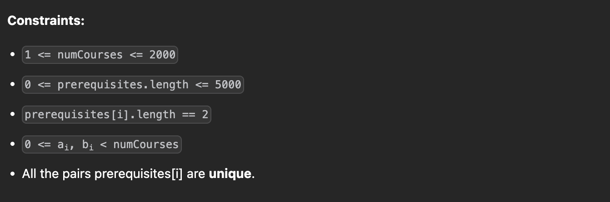

---

### 1. Cycle Detection (DFS)

**Intuition:**
We treat the problem as finding a cycle in a directed graph. If a cycle exists (e.g., A  B  A), it is impossible to finish the courses.

* We use **DFS** to traverse the graph.
* We maintain a `visiting` set to track the current recursion stack.
* If we encounter a node that is currently in `visiting`, we found a cycle  return `false`.
* If a node has no prerequisites (or we successfully checked them all), we mark it as "safe" (by clearing its entry in the map) to avoid redundant checks.

```javascript
class Solution {
    /**
     * @param {number} numCourses
     * @param {number[][]} prerequisites
     * @return {boolean}
     */
    canFinish(numCourses, prerequisites) {
        // Build Adjacency List
        const preMap = new Map();
        for (let i = 0; i < numCourses; i++) {
            preMap.set(i, []);
        }
        for (let [crs, pre] of prerequisites) {
            preMap.get(crs).push(pre);
        }

        // Set to track nodes in the current recursion stack
        const visiting = new Set();

        const dfs = (crs) => {
            // If we see a node already in the current stack, it's a cycle
            if (visiting.has(crs)) {
                return false;
            }
            // If the node has no prerequisites, it's safe/visited
            if (preMap.get(crs).length === 0) {
                return true;
            }

            visiting.add(crs);
            for (let pre of preMap.get(crs)) {
                if (!dfs(pre)) {
                    return false;
                }
            }
            
            // Backtrack: remove from visiting set
            visiting.delete(crs);
            // Optimization: Mark as visited/safe by clearing dependencies
            preMap.set(crs, []);
            return true;
        };

        // Check every course (graph might be disconnected)
        for (let c = 0; c < numCourses; c++) {
            if (!dfs(c)) {
                return false;
            }
        }
        return true;
    }
}

```

#### **Time & Space Complexity**

* **Time Complexity**: , where  is the number of courses and  is the number of prerequisites. We visit every node and edge at most once.
* **Space Complexity**:  to store the graph and recursion stack.

---

### 2. Topological Sort (Kahn's Algorithm / BFS)

**Intuition:**
This approach repeatedly removes nodes with **zero in-degrees** (courses with no prerequisites).

1. Calculate the **in-degree** (number of incoming edges) for every course.
2. Add all courses with `0` in-degree to a queue (these can be taken immediately).
3. Process the queue:
* "Finish" the course.
* Decrement the in-degree of its neighbors (dependent courses).
* If a neighbor's in-degree drops to `0`, add it to the queue.


4. If the number of finished courses equals `numCourses`, it's possible. Otherwise, there is a cycle.

```javascript
class Solution {
    /**
     * @param {number} numCourses
     * @param {number[][]} prerequisites
     * @return {boolean}
     */
    canFinish(numCourses, prerequisites) {
        let indegree = Array(numCourses).fill(0);
        let adj = Array.from({ length: numCourses }, () => []);
        
        // Build graph and calculate in-degrees
        for (let [src, dst] of prerequisites) {
            // Edge from dst -> src (dst is a prerequisite for src)
            // Note: The problem says [0, 1] means 1 is prereq for 0. So 1 -> 0.
            // adj[1].push(0) means when 1 finishes, 0 might be ready.
            indegree[src]++;
            adj[dst].push(src); 
        }

        // Initialize queue with courses having no prerequisites
        let q = []; 
        for (let i = 0; i < numCourses; i++) {
            if (indegree[i] === 0) {
                q.push(i);
            }
        }

        let finish = 0;
        while (q.length > 0) {
            let node = q.shift(); // Dequeue
            finish++;
            
            for (let nei of adj[node]) {
                indegree[nei]--;
                if (indegree[nei] === 0) {
                    q.push(nei);
                }
            }
        }

        return finish === numCourses;
    }
}

```

#### **Time & Space Complexity**

* **Time Complexity**: . We process each node and edge once.
* **Space Complexity**:  for the adjacency list and arrays.