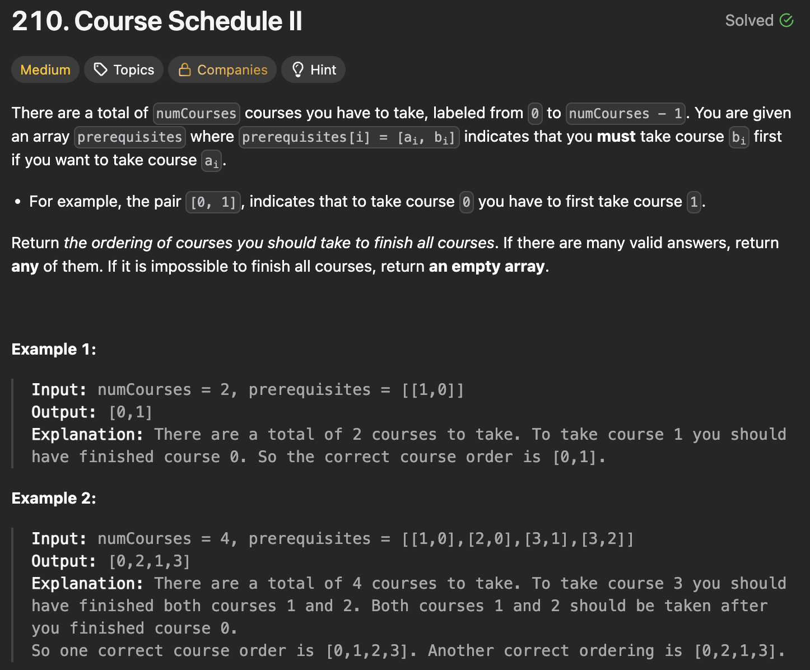
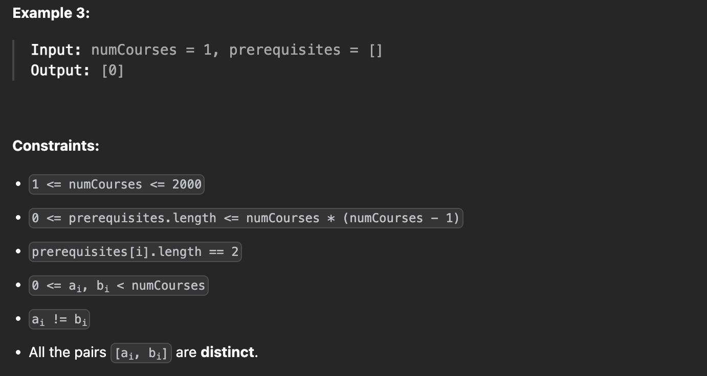

---

### 1. DFS (Cycle Detection + Reverse Post-Order)

**Intuition:**
We perform a Depth First Search (DFS) on the graph where edges represent `course -> prerequisite`.

* We traverse the graph. When we finish visiting a node (and all its prerequisites), we add it to the `output`.
* Because we add a node *after* visiting its children (prerequisites), the `output` array will be built in **Topological Order** directly (if we consider edges as dependencies).
* We use two sets: `cycle` (to detect back edges/cycles in the current path) and `visit` (to skip already processed nodes).

```javascript
class Solution {
    /**
     * @param {number} numCourses
     * @param {number[][]} prerequisites
     * @return {number[]}
     */
    findOrder(numCourses, prerequisites) {
        // Build Adjacency List: course -> list of prerequisites
        const prereq = new Map();
        for (const [course, pre] of prerequisites) {
            if (!prereq.has(course)) {
                prereq.set(course, []);
            }
            prereq.get(course).push(pre);
        }

        const output = [];
        const visit = new Set(); // Fully processed nodes
        const cycle = new Set(); // Nodes in current recursion stack

        const dfs = (course) => {
            if (cycle.has(course)) return false; // Cycle detected
            if (visit.has(course)) return true;  // Already processed

            cycle.add(course);
            for (const pre of (prereq.get(course) || [])) {
                if (!dfs(pre)) return false;
            }
            
            cycle.delete(course);
            visit.add(course);
            output.push(course); // Add to result after processing prerequisites
            return true;
        };

        for (let c = 0; c < numCourses; c++) {
            if (!dfs(c)) {
                return []; // Cycle detected
            }
        }

        return output;
    }
}

```

#### **Time & Space Complexity**

* **Time Complexity**: 
* **Space Complexity**: 

---

### 2. Kahn's Algorithm (BFS / In-Degree)

**Intuition:**
This approach builds the order from the "beginning" (courses with no prerequisites).

1. Build graph: `prerequisite -> dependent course`.
2. Count `indegree` (number of prerequisites) for each course.
3. Add courses with `0` indegree to a queue.
4. Process queue: Add course to result, decrement indegree of neighbors. If neighbor hits `0`, add to queue.
5. If result length equals `numCourses`, we found a valid order.

```javascript
class Solution {
    /**
     * @param {number} numCourses
     * @param {number[][]} prerequisites
     * @return {number[]}
     */
    findOrder(numCourses, prerequisites) {
        let indegree = Array(numCourses).fill(0);
        let adj = Array.from({ length: numCourses }, () => []);
        
        // Build graph: src (prereq) -> dst (course)
        for (let [course, pre] of prerequisites) {
            indegree[course]++;
            adj[pre].push(course);
        }

        let q = []; // Using array as queue
        for (let i = 0; i < numCourses; i++) {
            if (indegree[i] === 0) {
                q.push(i);
            }
        }

        let output = [];
        while (q.length > 0) {
            let node = q.shift();
            output.push(node);
            
            for (let nei of adj[node]) {
                indegree[nei]--;
                if (indegree[nei] === 0) {
                    q.push(nei);
                }
            }
        }

        return output.length === numCourses ? output : [];
    }
}

```

#### **Time & Space Complexity**

* **Time Complexity**: 
* **Space Complexity**: 

---

### 3. Topological Sort via DFS (Alternative)

**Intuition:**
This is similar to Kahn's algorithm but uses recursion (DFS) instead of a queue to process the nodes with `0` in-degree. It naturally explores paths until they hit a dependency wall. Note: This implementation is slightly less standard than Kahn's or the pure DFS post-order traversal but achieves the same result.

```javascript
class Solution {
    /**
     * @param {number} numCourses
     * @param {number[][]} prerequisites
     * @return {number[]}
     */
    findOrder(numCourses, prerequisites) {
        let adj = Array.from({ length: numCourses }, () => []);
        let indegree = Array(numCourses).fill(0);

        // Build graph: prereq -> course
        for (let [course, pre] of prerequisites) {
            indegree[course]++;
            adj[pre].push(course);
        }

        let output = [];

        const dfs = (node) => {
            output.push(node);
            indegree[node]--; // Mark as processed (-1)
            
            for (let nei of adj[node]) {
                indegree[nei]--;
                if (indegree[nei] === 0) {
                    dfs(nei);
                }
            }
        };

        // Start DFS from all sources (0 indegree)
        for (let i = 0; i < numCourses; i++) {
            if (indegree[i] === 0) {
                dfs(i);
            }
        }

        return output.length === numCourses ? output : [];
    }
}

```

#### **Time & Space Complexity**

* **Time Complexity**: 
* **Space Complexity**: