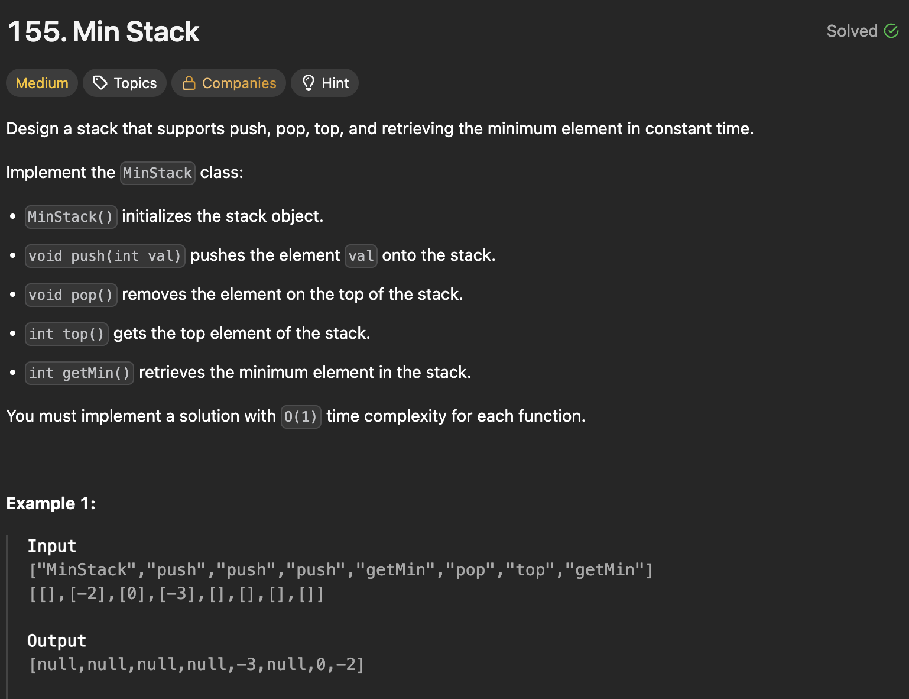
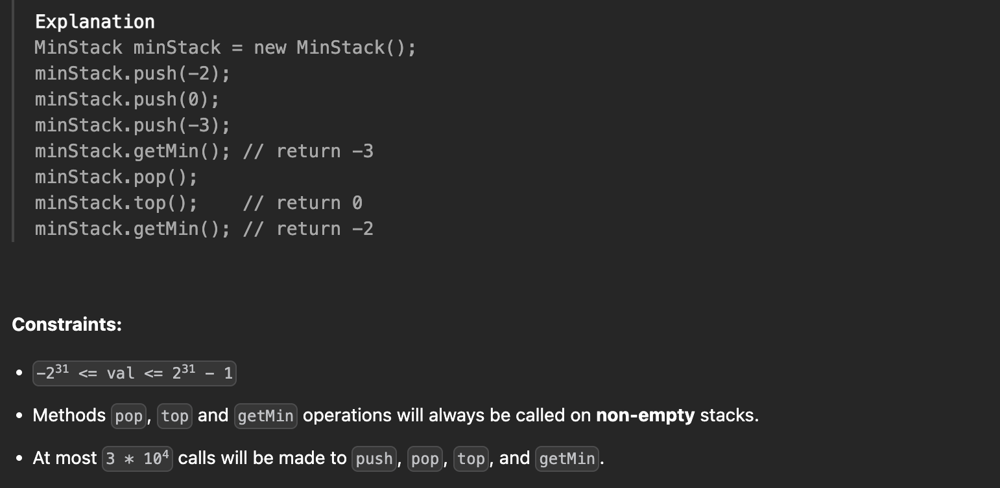

### 1\. Brute Force (Scan on `getMin`)

This straightforward approach uses a single, standard stack. The `push`, `pop`, and `top` operations are standard. However, to find the minimum element, the `getMin` method must **iterate through the entire stack** every time it's called, making it inefficient. 🐢

```javascript
class MinStack {
    constructor() {
        this.stack = [];
    }

    push(val) {
        this.stack.push(val);
    }

    pop() {
        this.stack.pop();
    }

    top() {
        return this.stack[this.stack.length - 1];
    }

    getMin() {
        if (this.stack.length === 0) return null;
        return Math.min(...this.stack); // A simpler way to write the scan
    }
}
```

#### **Time & Space Complexity**

  * **Time Complexity**: $O(n)$ for `getMin()` and $O(1)$ for all other operations.
  * **Space Complexity**: $O(n)$ to store the stack elements.

-----

### 2\. Two Stacks

This is the classic and most common solution. It uses a primary stack for the main data and a **second, auxiliary stack (`minStack`)** to keep track of the minimum value. Whenever a new element is pushed, we push the minimum of that element and the current minimum onto `minStack`. This ensures that `getMin` is always an $O(1)$ operation. ✅

```javascript
class MinStack {
    constructor() {
        this.stack = [];
        this.minStack = [];
    }

    push(val) {
        this.stack.push(val);
        const newMin = Math.min(
            val,
            this.minStack.length === 0 ? val : this.minStack[this.minStack.length - 1]
        );
        this.minStack.push(newMin);
    }

    pop() {
        this.stack.pop();
        this.minStack.pop();
    }

    top() {
        return this.stack[this.stack.length - 1];
    }

    getMin() {
        return this.minStack[this.minStack.length - 1];
    }
}
```

#### **Time & Space Complexity**

  * **Time Complexity**: $O(1)$ for all operations.
  * **Space Complexity**: $O(n)$ for the two stacks.

-----

### 3\. One Stack (Value Encoding)

This is a highly clever, space-optimized approach. It uses a single stack but **stores the difference** between a new value and the current minimum, rather than the value itself. By tracking how the minimum changes, we can deduce the previous minimum when an element is popped, allowing for $O(1)$ operations with just one stack and an extra variable. ✨

```javascript
class MinStack {
    constructor() {
        this.min = Infinity;
        this.stack = [];
    }

p
    push(val) {
        if (this.stack.length === 0) {
            this.stack.push(0);
            this.min = val;
        } else {
            // Push the difference
            this.stack.push(val - this.min);
            if (val < this.min) {
                this.min = val; // Update min if new value is smaller
            }
        }
    }

    pop() {
        if (this.stack.length === 0) return;

        const pop = this.stack.pop();

        // If the popped value is negative, it means the min changed.
        // Revert the min to its previous value.
        if (pop < 0) {
            this.min = this.min - pop;
        }
    }

    top() {
        const top = this.stack[this.stack.length - 1];
        // If top is positive, the real value is top + min.
        // If top is negative, the real value is the current min itself.
        return top > 0 ? top + this.min : this.min;
    }

    getMin() {
        return this.min;
    }
}
```

#### **Time & Space Complexity**

  * **Time Complexity**: $O(1)$ for all operations.
  * **Space Complexity**: $O(n)$ for the single stack.