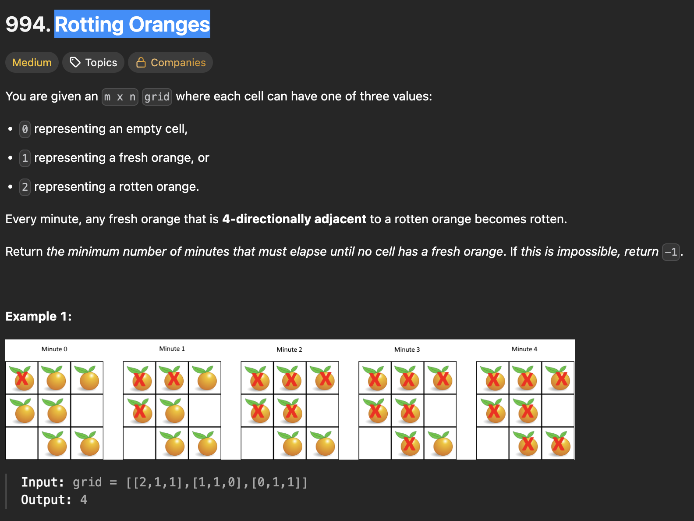
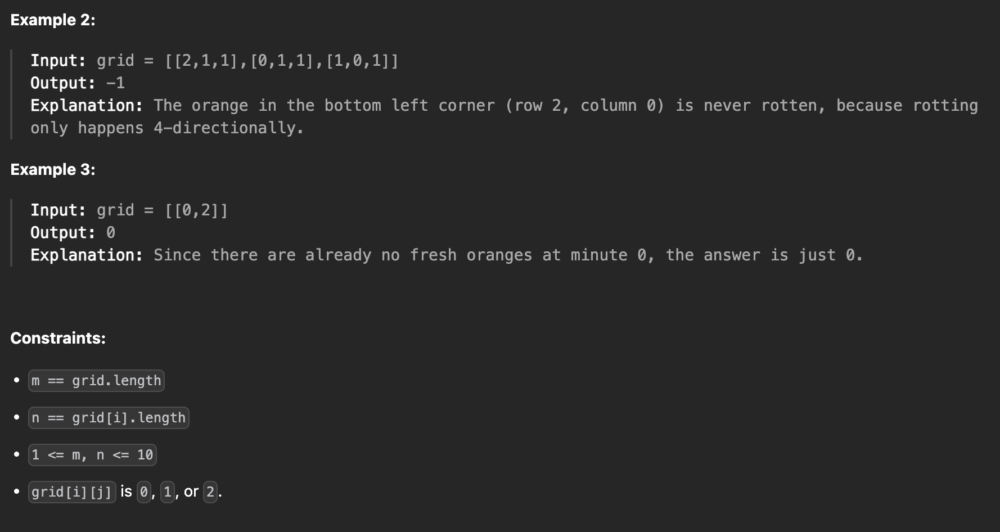
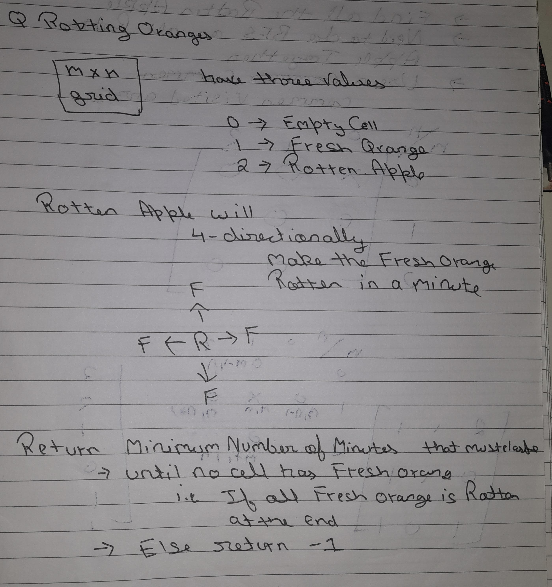
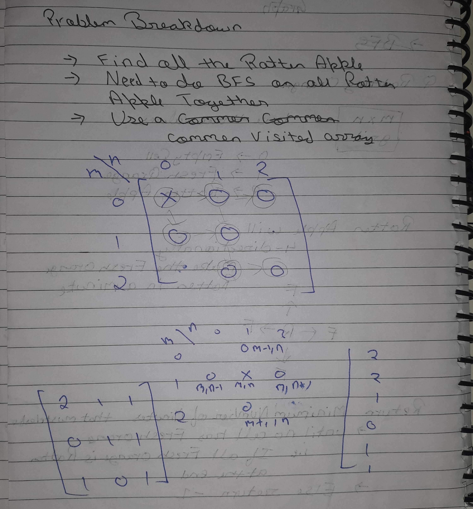

# Rotting Oranges

# Approach I am Thinking Off

1. Will Find All the Rotten Apple Index first
2. Will Perform BFS in all 4 Direction Parellely for all Index
3. Will Update the orange status
4. Will check for any fresh apple

