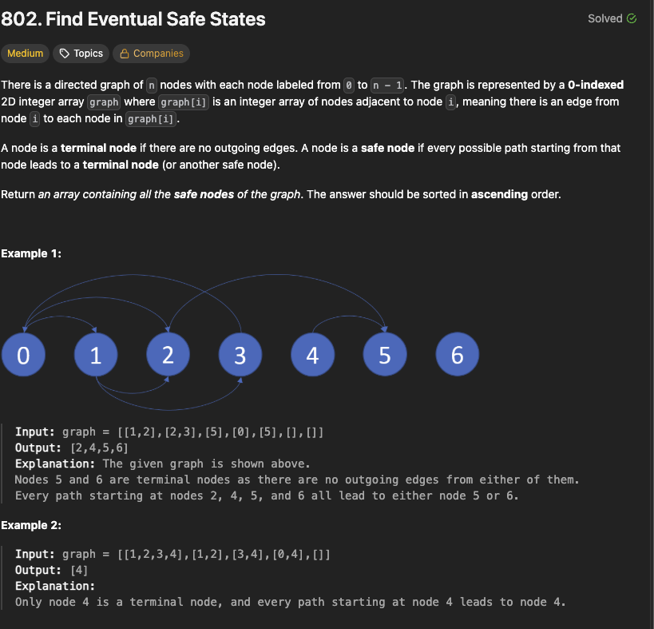

# Find Eventual Safe States

1. Directed Graph of `n` nodes
1. Each Node Labeled From `0` to `n - 1`
1. Graph is Represented by a 0-indexed 2D integer array `graph`
1. Where `graph[i]` is an Integer Array of Nodes adjacent to node `i`
1. A node is a `terminal node` if there are `no outgoing edges`
1. A node is a `safe node` if every possible path starting from that node leads to a `terminal node` (or another safe node).
